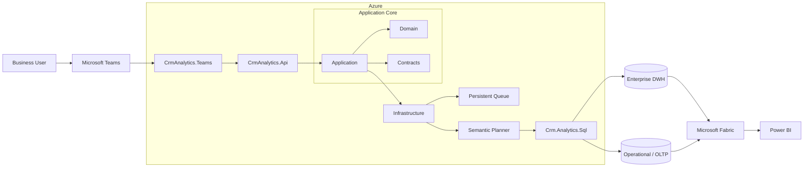
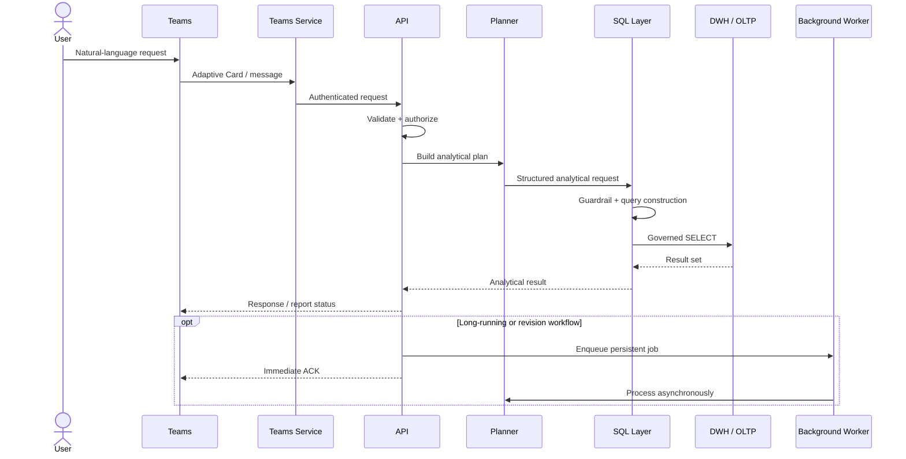
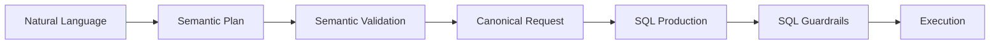
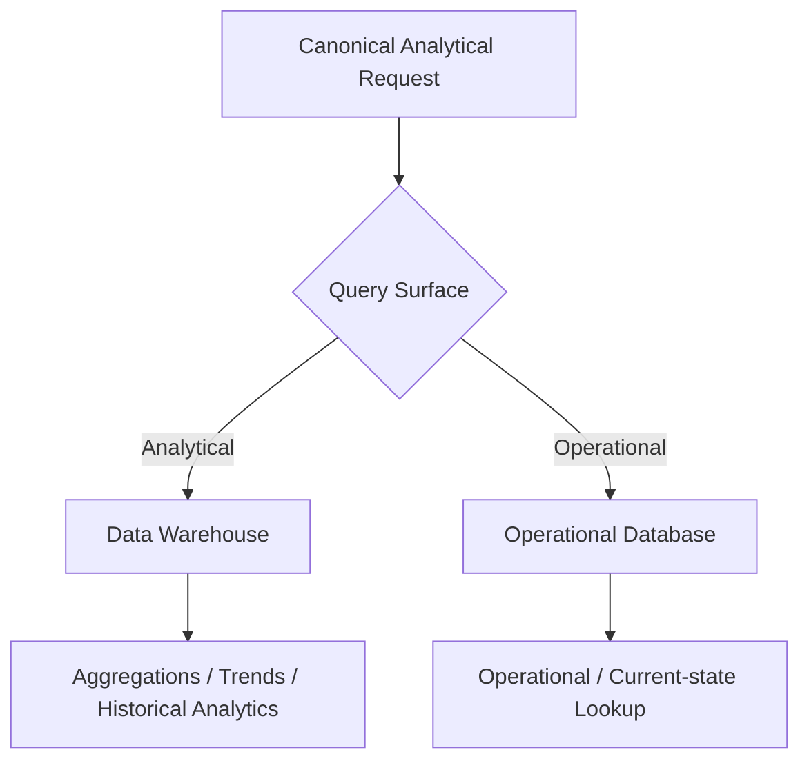
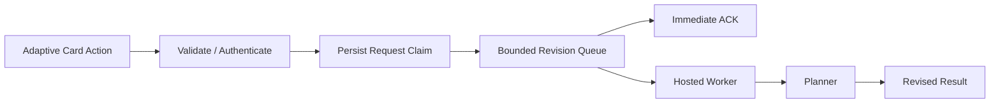
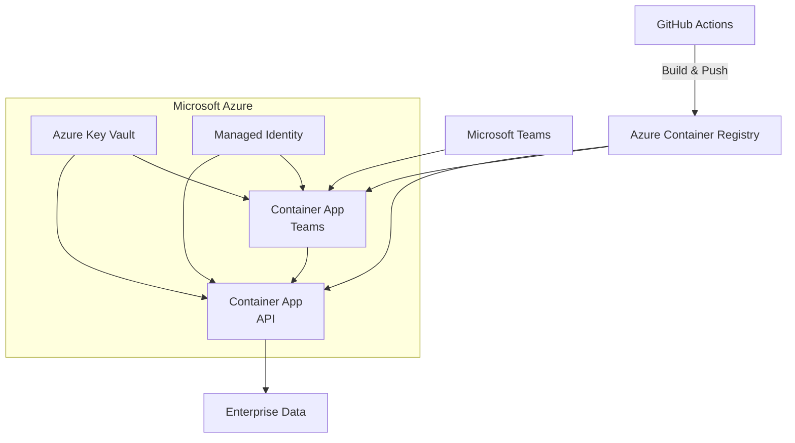
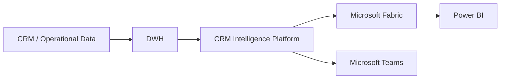
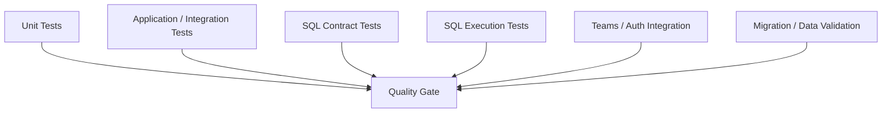

<div align="center">

# CRM Intelligence Platform

### Natural-language enterprise analytics through Microsoft Teams

Turn business questions into governed analytical operations across enterprise data sources — with semantic planning, secure SQL execution, Azure-native services and Microsoft analytics integrations.

<br>


<br>


</div>

---

## Overview

**CRM Intelligence Platform** is an enterprise analytics system designed to let users ask business questions in natural language through **Microsoft Teams** and receive governed, data-backed analytical results.

Instead of exposing users directly to SQL, database schemas or BI tooling, the platform converts business intent into a structured analytical plan, applies semantic and security constraints, routes the request to the appropriate data source and executes controlled queries through a dedicated SQL layer.

The system combines:

* Natural-language request processing
* Semantic analytical planning
* Guardrailed SQL generation
* DWH and OLTP query routing
* Persistent asynchronous workflows
* Microsoft Teams integration
* Azure Container Apps
* Microsoft Fabric and Power BI
* Infrastructure as Code
* CI/CD and extensive automated testing

---

## The Problem

Enterprise analytics often requires users to move between multiple systems:

```text
Business question
      ↓
Analyst / BI team
      ↓
Schema exploration
      ↓
SQL development
      ↓
Data validation
      ↓
Report creation
      ↓
Business user
```

This creates friction for operational questions that should be simple:

> Which products lost the most sales in the Marmara region this quarter?

> Compare Ege and Marmara sales performance over the last three months.

> Which customer segments have not made a purchase in the last 90 days?

> Show the categories with the strongest growth during the summer campaign.

CRM Intelligence Platform moves this interaction closer to:

```text
Business question
      ↓
Microsoft Teams
      ↓
Semantic interpretation
      ↓
Governed analytics
      ↓
Result
```

---

# Architecture



The platform deliberately separates:

* user interaction,
* analytical intent,
* domain logic,
* infrastructure,
* SQL production,
* data execution,
* reporting.

This keeps LLM-assisted interpretation away from unrestricted database execution.

---

# Request Lifecycle

A typical analytics request follows this path:



---

# Semantic Planning

The platform does not treat an LLM response as executable SQL.

Natural-language requests are first converted into a constrained analytical representation.

Conceptually:

```text
"Show the top 5 products whose sales fell the most
 in Marmara during the last three months."

                    ↓

Intent
├── region: Marmara
├── metric: sales
├── comparison: decline
├── dimension: product
├── time range: last 3 months
├── sorting: descending loss
└── top_n: 5
```

This structured request can then be validated against known dimensions, metrics and business rules before reaching SQL production.



This hybrid design provides flexibility where language understanding is useful and determinism where database access matters.

---

# Governed SQL Layer

`Crm.Analytics.Sql` is a dedicated analytical SQL production layer rather than an unrestricted text-to-SQL endpoint.

Responsibilities include:

* semantic catalog resolution,
* canonical request translation,
* dimension and metric validation,
* supported filter construction,
* aggregation logic,
* query routing,
* SQL safety validation,
* guardrail enforcement,
* analytical contract testing.

The design principle is simple:

> **AI may interpret the business question, but it does not receive unrestricted authority over the database.**

---

# DWH / OLTP Routing

Not every analytical request belongs to the same data surface.

The infrastructure layer can route workloads based on query semantics:



This avoids treating an OLTP system as a general analytics engine while still allowing operational data to participate where appropriate.

---

# Microsoft Teams Integration

Microsoft Teams is the primary conversational surface.

The Teams service supports:

* authenticated user interaction,
* Adaptive Cards,
* analytical requests,
* clarifications,
* revisions,
* asynchronous job acknowledgement,
* downstream token forwarding,
* proactive result delivery patterns.

Revision and clarification flows are processed through a bounded background queue rather than forcing long-running work into the original request.



---

# Azure Deployment

The current cloud-native runtime targets **Azure Container Apps**.



Infrastructure definitions are maintained as code under:

```text
infra/azure/bicep/
```

The deployment pipeline builds SHA-tagged container images and uses canonical Bicep parameters for revision deployment.

---

# Microsoft Analytics Ecosystem

The platform is designed to integrate with the broader Microsoft analytics stack:



This allows conversational analytics and traditional BI/reporting workflows to coexist rather than compete.

---

# Technology Stack

| Layer                  | Technologies                                                          |
| ---------------------- | --------------------------------------------------------------------- |
| **Backend**            | C#, .NET 10, ASP.NET Core                                             |
| **Architecture**       | Application, Domain, Contracts, Infrastructure                        |
| **Analytics**          | Semantic Planning, Canonical Requests, Governed SQL                   |
| **Data**               | SQL, SQLite fixtures, DWH, OLTP                                       |
| **AI Integration**     | LLM-assisted semantic planning, Ollama evaluation tooling             |
| **Messaging**          | Persistent / asynchronous processing                                  |
| **Frontend Surface**   | Microsoft Teams, Adaptive Cards                                       |
| **Analytics Platform** | Microsoft Fabric, Power BI                                            |
| **Cloud**              | Microsoft Azure                                                       |
| **Runtime**            | Azure Container Apps                                                  |
| **Security**           | Entra-based authentication, managed configuration, Key Vault patterns |
| **Containers**         | Docker                                                                |
| **Infrastructure**     | Bicep                                                                 |
| **CI/CD**              | GitHub Actions                                                        |
| **Testing**            | Unit, integration, SQL contract and execution tests                   |

---

# Repository Structure

```text
.
├── .config/
├── .github/
│   └── workflows/
│
├── src/
│   ├── CrmAnalytics.Api/
│   ├── CrmAnalytics.Application/
│   ├── CrmAnalytics.Contracts/
│   ├── CrmAnalytics.Domain/
│   ├── CrmAnalytics.Infrastructure/
│   ├── CrmAnalytics.Teams/
│   └── Crm.Analytics.Sql/
│
├── tests/
│   ├── CrmAnalytics.UnitTests/
│   ├── CrmAnalytics.IntegrationTests/
│   ├── CrmAnalytics.DataScopeProvisioner.Tests/
│   ├── Crm.Analytics.Sql.Tests/
│   └── Crm.Analytics.Sql.IntegrationTests/
│
├── tools/
│   ├── CrmAnalytics.DataScopeProvisioner/
│   ├── CrmAnalytics.OllamaSmoke/
│   └── Crm.Analytics.Sql.DevData/
│
├── data/
│   └── fixtures/
│       └── olist/
│
├── infra/
│   └── azure/
│       └── bicep/
│
├── deploy/
│   ├── scripts/
│   ├── sql/
│   └── teams/
│
├── scripts/
│   └── smoke/
│
├── docs/
│   ├── architecture/
│   ├── deployment/
│   ├── operations/
│   ├── testing/
│   ├── planning/
│   └── archive/
│
├── crm-project/             # Temporary legacy compatibility
├── crm-project.Tests/       # Temporary legacy compatibility
│
├── CrmAnalytics.slnx
├── docker-compose.local.yml
├── global.json
├── AGENTS.md
└── README.md
```

---

# Projects

### Runtime

| Project                       | Responsibility                                            |
| ----------------------------- | --------------------------------------------------------- |
| `CrmAnalytics.Api`            | HTTP/API host and runtime composition                     |
| `CrmAnalytics.Application`    | Application workflows and orchestration                   |
| `CrmAnalytics.Contracts`      | Shared application and integration contracts              |
| `CrmAnalytics.Domain`         | Core domain behavior                                      |
| `CrmAnalytics.Infrastructure` | Persistence, integrations, execution and external systems |
| `CrmAnalytics.Teams`          | Microsoft Teams interaction layer                         |
| `Crm.Analytics.Sql`           | Governed analytical SQL production                        |

### Tools

| Project                             | Purpose                                           |
| ----------------------------------- | ------------------------------------------------- |
| `CrmAnalytics.DataScopeProvisioner` | Data access scope provisioning                    |
| `Crm.Analytics.Sql.DevData`         | Deterministic development/test fixture generation |
| `CrmAnalytics.OllamaSmoke`          | Local semantic-planning quality evaluation        |

---

# Testing

The repository uses multiple testing layers rather than relying only on application-level unit tests.



Current verified baseline:

| Validation            |             Result |
| --------------------- | -----------------: |
| Release build         |       **0 errors** |
| Build warnings        |              **0** |
| Full test suite       |   **1,546 passed** |
| Failed tests          |              **0** |
| Skipped tests         |              **0** |
| SQL integration tests | **71 / 71 passed** |

---

# Getting Started

## Requirements

The repository currently targets the SDK defined in `global.json`:

```text
.NET SDK 10.0.301
```

Depending on the workflow, you may also need:

* Docker
* Azure CLI
* Bicep
* access to required external services

---

## Restore tools

```bash
dotnet tool restore
```

## Restore

```bash
dotnet restore CrmAnalytics.slnx
```

## Build

```bash
dotnet build CrmAnalytics.slnx -c Release --no-restore
```

## Test

```bash
dotnet test CrmAnalytics.slnx -c Release --no-build
```

---

# Local Test Data

Deterministic development and integration data is generated from the fixture dataset under:

```text
data/fixtures/olist/
```

The DevData tool is located at:

```text
tools/Crm.Analytics.Sql.DevData/
```

Generated local databases such as:

```text
crm_dev.db
```

are intentionally excluded from Git.

---

# Local Development

The repository contains a local Docker Compose configuration:

```text
docker-compose.local.yml
```

Example:

```bash
docker compose -f docker-compose.local.yml up --build
```

Environment-specific credentials and secrets must not be committed to the repository.

---

# CI/CD

GitHub Actions workflows live under:

```text
.github/workflows/
```

### `ci.yml`

Validates the canonical application baseline:

* restore,
* Release build,
* test fixture generation,
* full automated test suite,
* SQL integration,
* migration consistency,
* container build configuration.

### `deploy-azure.yml`

Handles the current Azure Container Apps deployment path:

* container build,
* Azure Container Registry,
* migration artifacts,
* Bicep infrastructure,
* API deployment,
* Teams deployment,
* revision validation.

### Legacy Web App workflow

A temporary legacy Azure Web App deployment path remains in the repository for compatibility during migration.

It is isolated from the canonical solution and runtime architecture and can be removed after production cutover is independently verified.

---

# Documentation

Detailed documentation lives under [`docs/`](docs/README.md).

Key areas include:

| Area               | Location             |
| ------------------ | -------------------- |
| Architecture       | `docs/architecture/` |
| Deployment         | `docs/deployment/`   |
| Operations         | `docs/operations/`   |
| Testing            | `docs/testing/`      |
| Planning           | `docs/planning/`     |
| Historical records | `docs/archive/`      |

---

# Security Principles

The platform follows several core security boundaries:

* authenticated access,
* explicit data scopes,
* controlled analytical surfaces,
* constrained SQL production,
* configuration through environment/secrets,
* no committed credentials,
* separation between natural-language interpretation and database authority,
* auditable application workflows.

Sensitive configuration is expected to be supplied through environment-specific secret management rather than source control.

---

# Design Principles

<table>
<tr>
<td width="50%" valign="top">

### Deterministic where it matters

Language interpretation can be probabilistic.

Database access, authorization, query constraints and execution boundaries should not be.

</td>

<td width="50%" valign="top">

### Semantic before SQL

Business intent is modeled first.

SQL is produced only after the request has been translated into an understood analytical structure.

</td>
</tr>

<tr>
<td width="50%" valign="top">

### Async by design

Long-running work should not unnecessarily block conversational request lifecycles.

Persistent queues and workers are used where appropriate.

</td>

<td width="50%" valign="top">

### Enterprise integration first

The platform is designed around systems organizations already use:

Teams, Azure, Fabric, Power BI and governed enterprise data.

</td>
</tr>
</table>

---

# Screenshots

> Add product screenshots here once the preferred public-safe demo captures are finalized.

<table>
<tr>
<td width="50%" align="center">

### Microsoft Teams


</td>

<td width="50%" align="center">

### Analytics Result


</td>
</tr>
</table>

<table>
<tr>
<td width="50%" align="center">

### Power BI


</td>

<td width="50%" align="center">

### Azure Architecture


</td>
</tr>
</table>

---

# Roadmap

The platform architecture leaves room for further work around:

* richer semantic catalogs,
* dynamic analytical visualization,
* expanded Microsoft Fabric integration,
* business-rule driven reporting,
* agent-assisted analytical workflows,
* stronger observability and evaluation,
* additional enterprise data connectors.

---

<div align="center">

## CRM Intelligence Platform

### Business questions → semantic intent → governed analytics → actionable insight

<br>

**Microsoft Teams · .NET · Azure · SQL · Fabric · Power BI · AI**

</div>
