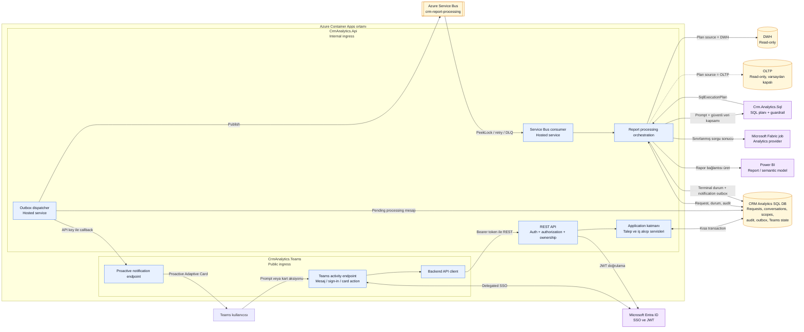
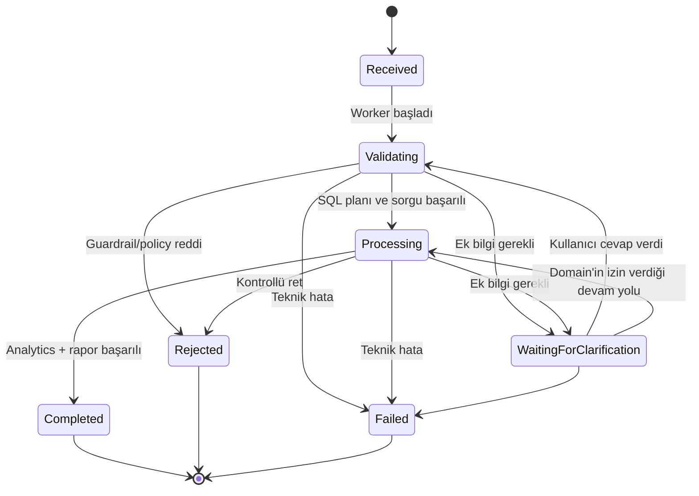
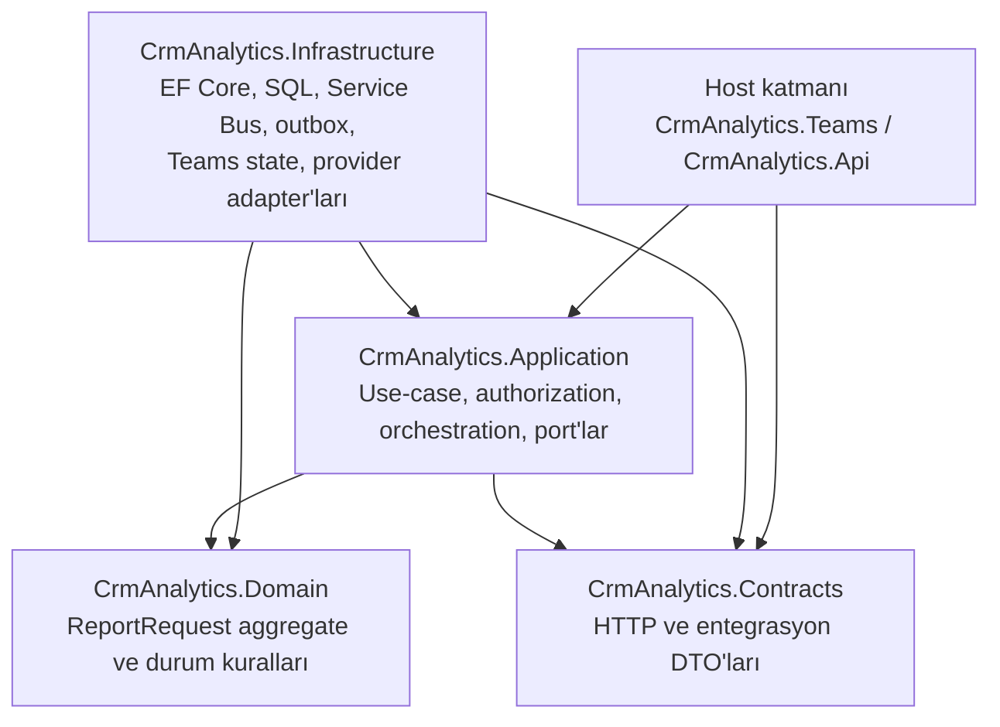

# CRM Analytics sistem mimarisi

Bu belge, repository'deki çalışan kodun **as-built** görünümünü özetler. Sistem iki
ayrı uygulamadan oluşur: dışarıya açık Microsoft Teams host'u ve iç ağda çalışan
API/worker uygulaması. Rapor üretimi, kullanıcı HTTP isteği açık tutulmadan
asenkron olarak gerçekleştirilir.

## 1. Üst seviye mimari



### Deployment sınırı

- `CrmAnalytics.Teams`: Teams/Bot trafiğini alan, public ingress'li ayrı Container
  App'tir.
- `CrmAnalytics.Api`: REST API ile birlikte outbox dispatcher ve Service Bus
  consumer'ını aynı process içinde çalıştıran internal ingress'li Container
  App'tir. Repository'de ayrı bir worker executable/deployment yoktur.
- SQL DB, Service Bus, Entra/Bot, DWH/OLTP, Power BI ve Fabric Bicep tarafından
  oluşturulmaz; mevcut dış kaynaklar olarak beklenir.

## 2. Bir rapor talebi nasıl çalışır?

```mermaid
sequenceDiagram
    autonumber
    actor U as Teams kullanıcısı
    participant T as CrmAnalytics.Teams
    participant E as Entra ID
    participant A as CrmAnalytics.Api
    participant D as SQL DB + Outbox
    participant B as Azure Service Bus
    participant W as API içindeki worker
    participant S as Crm.Analytics.Sql
    participant Q as DWH veya OLTP
    participant F as Analytics (Direct/Fabric)
    participant P as Power BI

    U->>T: Doğal dilde rapor talebi
    T->>E: Teams SSO token al
    E-->>T: Delegated access token
    T->>A: POST /api/report-requests + Bearer token
    A->>A: JWT, scope, rol, ownership ve data-scope kontrolü
    A->>D: Request + conversation + audit + processing outbox
    D-->>A: Transaction commit
    A-->>T: 202 Accepted + requestId
    T->>A: Request-conversation target kaydı
    T-->>U: Talep alındı

    Note over U,T: HTTP kullanıcı akışı burada biter; işleme arka planda devam eder

    W->>D: Processing outbox kaydını claim et
    W->>B: ReportProcessingRequested publish
    B-->>W: Mesajı PeekLock ile teslim et
    W->>D: Request'i yükle, güncel data-scope'u çöz
    W->>D: Durum = Validating
    W->>S: Prompt + scope + conversation context

    alt Ek bilgi gerekiyor
        S-->>W: NeedsClarification + güvenli soru
        W->>D: WaitingForClarification + audit + notification outbox
    else Politika reddi
        S-->>W: Rejected
        W->>D: Rejected + audit + notification outbox
    else Plan kabul edildi
        S-->>W: SQL + typed parameters + source + limitler
        W->>Q: Yalnız seçilen kaynağa read-only sorgu
        Q-->>W: Boyutu sınırlandırılmış sonuç
        W->>D: Durum = Processing
        W->>F: Analiz et
        F-->>W: Özet + result reference
        W->>P: Rapor bağlantısını üret/doğrula
        P-->>W: Güvenli Power BI web URL
        W->>D: Completed + audit + notification outbox
    end

    W->>D: Notification outbox kaydını claim et
    W->>T: Internal callback (API key)
    T-->>U: Proactive Adaptive Card
    W->>D: Delivery = Delivered
```

İlk API cevabındaki `202 Accepted`, raporun hazır olduğunu değil; talep ile işleme
niyetinin aynı transaction içinde kalıcı olarak kaydedildiğini gösterir.

## 3. Rapor durum modeli



`Queued` ve `Running` durumları domain sözleşmesinde bulunur; mevcut worker akışı
bu iki durumu set etmez. Fiili normal yol şöyledir:

`Received -> Validating -> Processing -> Completed`

## 4. Kod katmanları



Bağımlılık yönü business kurallarını dış sistemlerden ayırır: Application katmanı
arayüzleri tanımlar, Infrastructure bu arayüzleri SQL Server, Service Bus, Fabric
ve Power BI adapter'larıyla gerçekleştirir.

## 5. Sistemi okurken bilinmesi gereken sınırlar

- Transactional outbox, request/durum değişikliği ile mesaj niyetini atomik tutar;
  teslimat semantiği **at-least-once**'dur, global exactly-once değildir.
- Azure Service Bus mesajında prompt, token, SQL veya sonuç satırları taşınmaz;
  worker request'i ve güncel yetki kapsamını DB'den yeniden yükler.
- DWH varsayılan sorgu kaynağıdır. OLTP varsayılan olarak kapalıdır ve otomatik
  DWH/OLTP fallback yoktur.
- `FabricJob` adapter kodu bulunsa da kalıcı sonuç staging contract'ı mevcut
  değildir; gerçek sorgu sonucu ile Fabric aktivasyonu fail-closed olur.
- Power BI linki veri yetkisi sağlamaz; erişim Entra/Power BI/RLS tarafında ayrıca
  uygulanmalıdır.

Daha ayrıntılı route, güvenlik, persistence ve operasyon analizi için
[`AS_BUILT_ARCHITECTURE_2026-08-02.md`](../archive/architecture/AS_BUILT_ARCHITECTURE_2026-08-02.md) tarihsel belgesine bakın.
